# react-reconciler

核心，React Fiber的相关内容都在这里

`tips: 请注意React源码中有很多old和new的文件，这里我们只采用目前生效的代码`

这里的核心方法是createContainer和updateContainer

createContainer相对比较简单
updateContainer 过于复杂，估计有上万行代码，十分头痛

## updateContainer

大概的执行流程如下：

1. 首先调用requestEventTime,有如下判断  
a. 如果executionContext处于update阶段或者commit阶段，返回now()   
b. 如果处于浏览器的宏/微任务回调，就返回上次处于react执行阶段时设置的时间

2. 调用requestUpdateLane，LegacyMode下，返回的永远是SyncLane

3. 调用getContextForSubtree,初次渲染时返回的始终是空对象

4. 调用createUpdate，创建一个空的update对象

5. 调用enqueueUpdate，将update对象放入fiber.updateQueue.pending的环状链表中

6. 调用scheduleUpdateOnFiber，执行调度

## scheduleUpdateOnFiber（针对需要更新的fiber）

执行流程如下：

1. 调用markUpdateLaneFromFiberToRoot，此方法作用为:  
  a. 执行mergeLanes来更新当前fiber和当前fiber的alternate的lanes   
  b. 执行while循环，获取fiber的parent。同样执行mergeLanes来更新parent和parent的alternate的lanes  
  c. 直到执行到parent为null，代表到头了，此时应该是rootFiber。返回rootFiber的stateNode，也就是fiberRoot

2. 调用markRootUpdated,将当前lane放入fiberRoot的pendingLanes里面。（这里要注意的是，操作的是fiberRoot，不是rootFiber）

3. 调用ensureRootIsScheduled

## ensureRootIsScheduled （针对fiberRoot）

执行流程如下：

1. 调用markStarvedLanesAsExpired，从fiberRoot的pendingLanes中找到过期的那个，放到expiredLanes中去

2. 调用getNextLanes，根据fiberRoot中的pendingLanes，suspendedLanes，pingedLanes确定出当前最紧急的lanes （suspendedLanes，pingedLanes和suspense有关，可以先忽略）

3. 调用getHighestPriorityLane，根据上面的lanes获取最紧急的lane。（一般情况下此处lanes和lane的值相等）
 
4. 调用scheduleLegacySyncCallback，将performSyncWorkOnRoot放入syncQueue的全局队列中

5. 执行promise.resolve。在下个微任务执行flushSyncCallbacks   
  a. flushSyncCallbacks: 从syncQueue中依次取出任务来执行（当前上下文，也就是会执行performSyncWorkOnRoot）

## performSyncWorkOnRoot

> 调用renderRootSync

## renderRootSync

1. 调用prepareFreshStack， 初始化workInProgressRoot和workInProgress。workInProgressRoot设置为fiberRoot,workInProgress设为rootFiber的alternate

2. 调用workLoopSync

## workLoopSync （关键字： Loop）

1. 不断的检测workInProgress。只要存在就循环执行performUnitOfWork

## performUnitOfWork

1. 调用beginWork，返回的是childFiber, 这里要和workLoopSync一起来看。返回的childFiber会被重新赋值给workInProgress，会重新执行performUnitOfWork

2. 如果所有child执行完成，调用completeUnitOfWork

## beginWork （递阶段）

1. 检查props或者context是否发生变化，如果没变化，就执行attemptEarlyBailoutIfNoScheduledUpdate，跳过当前fiber。返回此fiber的child

2. 调用mountIndeterminateComponent进入mount

## mountIndeterminateComponent

1. 获取当前contextStackCursor所指向的context

2. 调用renderWithHooks，实际上就是执行render方法，得到render返回的children

3. 调用reconcileChildren

## reconcileChildren (diff算法!!)

1. 调用mountChildFibers

## mountChildFibers

1. 判断renderWithHooks返回的children的类型

2. 如果返回的是单个element, 执行reconcileSingleElement

3. 如果返回的是数组，执行reconcileChildrenArray

## reconcileSingleElement

1. 判断当前child的key是否和新element的key相同，包括null

2. 如果key相同并且类型相同， 则把原child的所有兄弟节点标记为删除，并调用useFiber，复用child的alternate

3. 如果上面不匹配，则创建一个新的fiber

## reconcileChildrenArray （经典diff过程）

1. 第一遍循环：简单匹配，假设每个位置都能一一对应，如果都能一一对应，则万事大吉，清理现场退出。如果没能全对上，进入第二个循环

2. 第二遍循环：检查没配上的原因是不是以前的fiber不够用，如果是的则从不够的地方开始一个个创建。如果不是因为不够用，则往下执行

3. 先把之前剩下的fiber。放入一个Map中，key值为fiber的key或者index。（所以这里，很多人会把index设置为key。如果进入到第三个循环，那设不设实际上是一样的）

4. 第三遍循环：继续之前没创建完的位置，如果设置key，则从Map找有没有key相同的。有相同的并且type相同，则复用。如果没设置key。就用index来查。如果还找不到就创建新的。

5. 最后清理剩下的老的child，设置为删除

## completeUnitOfWork （归阶段）

1. 对当前fiber执行completeWork，做一些subTree优先级相关的设置和真实dom的生成

2. 将workInProgress设置为当前fiber的sibling.如果sibling不为空则开始下个循环的workLoop

3. 如果sibling为空, 则执行returnFiber的completeUnitOfWork

# 流程图

